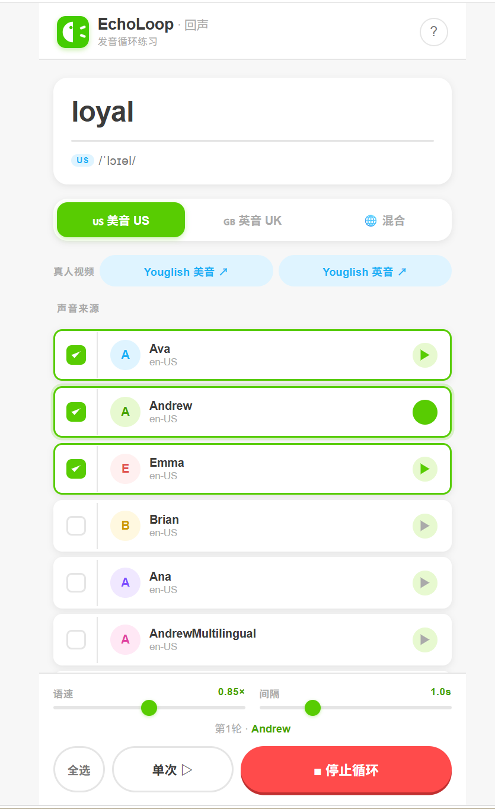

# 回声 · 发音循环练习

一款帮助你反复听同一个英语单词多种发音的 Web 应用，让你的耳朵快速建立正确的语音记忆。

  

## 功能特点

- **多发音源**：自动加载系统中的美音/英音语音，支持选择不同发音人
- **循环播放**：自由控制播放间隔和语速，循环练习
- **音标显示**：自动从 Dictionary API 获取英美音标
- **真人发音**：集成 Youglish，跳转到 YouTube 视频中的真实发音片段
- **PWA 支持**：可安装到桌面/手机主屏幕，像原生 App 一样使用

## 使用方法

1. 输入想练习的单词
2. 选择美音 / 英音 / 混合
3. 勾选想听的声音，点击某个声音可单独试听
4. 调整语速（建议 0.8–0.9×）和间隔（建议 1s）
5. 点击「循环」开始反复播放

## 安装为 App

在浏览器中打开后，选择「添加到主屏幕」或「安装」即可。

## 技术栈

- 纯 HTML/CSS/JavaScript，无框架依赖
- PWA (Service Worker + Manifest)
- Web Speech API
- Dictionary API

## 浏览器兼容性

| 浏览器 | 体验 | 说明 |
|--------|------|------|
| Edge (Windows) | ⭐⭐⭐⭐⭐ 最佳 | 可调用 Microsoft Neural 高质量神经网络语音（Aria、Guy、Jenny 等） |
| Chrome (Windows) | ⭐⭐⭐⭐ 推荐 | 可调用 Google 在线语音，效果接近 Edge |
| Safari (macOS/iOS) | ⭐⭐⭐ 可用 | 使用 Apple Siri 系统语音，声音种类较少 |
| Chrome (Android) | ⭐⭐⭐ 可用 | 效果取决于设备安装的语音包，Pixel 系列较好 |
| Firefox | ⚠️ 不推荐 | 仅支持本地离线语音，质量较差 |

> **核心功能强依赖联网 TTS**：应用通过浏览器的 Web Speech API 调用系统/云端语音引擎，高质量声音（Microsoft Neural、Google 在线语音）均需要网络连接。建议在 **Windows + Edge 或 Chrome** 下使用以获得最佳效果。

## 开发

直接打开 `index.html` 即可本地运行，无需构建。

## 开源协议

MIT License